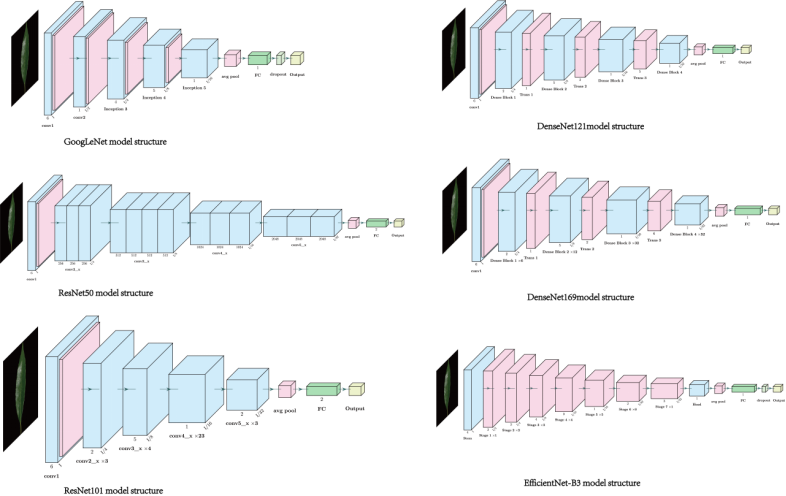
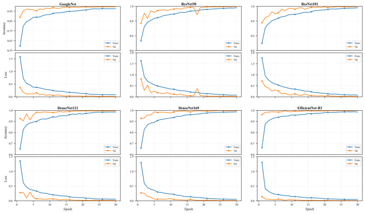

# Accurate Identification of *Ilex* (Aquifoliaceae) Taxa Based on Leaf Morphology Using Deep Learning


This repository focuses on fine-grained classification of *Ilex* leaf images using PyTorch, with a unified training and evaluation pipeline across six CNN architectures:
`GoogLeNet`, `ResNet50`, `ResNet101`, `DenseNet121`, `DenseNet169`, and `EfficientNet-B3`.

> Related paper: **Accurate Identification of *Ilex* (Aquifoliaceae) Taxa Based on Leaf Morphology Using Deep Learning**

## Highlights 🌟

- Data scale: 45 taxa, about 11,500 leaf images (controlled laboratory conditions)
- Under a unified setup, all six models achieved test accuracy above 99%
- Best-performing models: DenseNet121 / DenseNet169, with **99.65%** accuracy
- Includes a 5-fold cross-validation script for EfficientNet-B3
- Includes AI Holly web demo deployment logic (Top-3 predictions)

## Key Results 📊

| Model | Accuracy (%) | F1 (%) | Params (M) |
|---|---:|---:|---:|
| GoogLeNet | 99.59 | 99.59 | 6.8 |
| ResNet50 | 99.59 | 99.59 | 25.6 |
| ResNet101 | 99.48 | 99.48 | 44.5 |
| DenseNet121 | **99.65** | **99.65** | 8.0 |
| DenseNet169 | **99.65** | **99.65** | 14.2 |
| EfficientNet-B3 | 99.19 | 99.19 | 12.0 |

EfficientNet-B3 5-fold (image-level split) result: **99.40% ± 0.12%**.

## Figures 🖼️

### 1) Model Architectures


### 2) Training and Validation Curves


### 3) AI Holly Web Demo


## Project Structure 📁

```text
.
├── requirements.txt
├── train_multi_models.py            # unified training/evaluation across six models
└── train_efficientnet_5fold_cv.py   # EfficientNet-B3 5-fold cross-validation
```

## Quick Start 🚀

### 1) Install Dependencies ⚙️

```bash
pip install -r requirements.txt
```

### 2) Prepare the Dataset 🗂️

Current default path in both scripts:

```python
# in both scripts
data_path = '/home/featurize/data/Ilex_data46/Ilex_data'
```

Change it to your local dataset root, organized in `ImageFolder` format:

```text
Ilex_data/
├── class_01/
├── class_02/
└── ...
```

### 3) Train and Evaluate 🧠

Train all six models:

```bash
python train_multi_models.py
```

Run EfficientNet-B3 5-fold cross-validation:

```bash
python train_efficientnet_5fold_cv.py
```

## Notes on Generalization 🔍

Current paper and code results are based on an **image-level split**, which may overestimate real-world generalization. A **plant-level split** is recommended for stricter future evaluation.

## Citation 📚

If you use this project, please cite the related paper and this repository.
